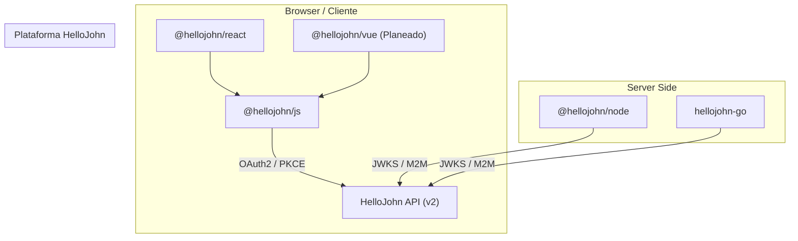

# SDKs de HelloJohn

> **La Suite de Desarrollo para la Plataforma de Identidad HelloJohn**

Bienvenido al repositorio oficial de los **SDKs de HelloJohn**. Esta colección de librerías está diseñada para integrar autenticación segura, multi-tenant y escalable en tus aplicaciones de manera rápida y sin fricción.

Ya sea que estés construyendo una Single Page App (SPA), una API server-side, o una aplicación full-stack con Next.js, tenemos un SDK optimizado para tu stack tecnológico.

---

## 📦 Ecosistema de SDKs

| SDK | Paquete | Descripción | Estado |
| :--- | :--- | :--- | :--- |
| **[JavaScript Core](js/README.md)** | `@hellojohn/js` | El núcleo fundacional para el navegador. Maneja OAuth2 con PKCE, Gestión de Tokens, MFA y Almacenamiento Seguro. Cero dependencias runtime. | ✅ Estable |
| **[React](react/README.md)** | `@hellojohn/react` | Componentes y hooks (`useAuth`, `<SignIn />`, `<UserButton />`) listos para usar. Incluye Temas, Internacionalización (i18n) y soporte SSR para Next.js. | ✅ Estable |
| **[Node.js](node/README.md)** | `@hellojohn/node` | Verificación server-side y autenticación M2M (Machine-to-Machine). Incluye middleware para Express y validación de JWT con caché de JWKS. | ✅ Estable |
| **[Go](go/README.md)** | `hellojohn-go` | Cliente nativo en Go para servicios backend. Middleware HTTP, cliente M2M y verificación JWT sin dependencias externas pesadas. | ✅ Estable |

---

## 🎯 Principios de Diseño

Nuestros SDKs están construidos con una mentalidad **"Developer First"**:

*   **⚡ Zero Config**: Usamos defaults inteligentes. A menudo, solo necesitas el `domain` y `clientId` para comenzar.
*   **🛡️ Type-Safe**: Escritos en TypeScript (y Go nativo) para ofrecer un autocompletado excelente y seguridad en tiempo de compilación.
*   **🏢 Multi-Tenant Nativo**: Soporte de primera clase para multi-tenancy. Cambia de tenants o resuélvelos automáticamente desde subdominios o rutas.
*   **🔒 Seguridad Sanity-Check**: Manejamos las partes difíciles de OAuth2 (PKCE, State, Nonce, Token Refresh, JWKS caching) por ti.
*   **📦 Bundles Pequeños**: Arquitectura modular que asegura que solo empaquetes lo que realmente usas.

---

## 🏗 Arquitectura

El ecosistema de SDKs está estructurado en capas para asegurar consistencia y mantenibilidad:



### Capacidades Core

*   **Autenticación**: Login con Credenciales, Proveedores Sociales (Google) y Magic Links (Planeado).
*   **Gestión de Sesión**: Renovación automática de tokens, abstracción de almacenamiento seguro (Local/Session/Cookie/Memory).
*   **MFA (Multi-Factor)**: Soporte completo para enrolamiento y flujos de desafío TOTP.
*   **RBAC (Role-Based Access Control)**: Utilidades para verificar Roles y Permisos tanto en cliente como en servidor.
*   **Machine-to-Machine (M2M)**: Soporte para flujo `client_credentials` para comunicación servicio-a-servicio.

---


## 🚀 Comenzando

Elige tu camino:

### 1. Frontend: React / Next.js
Instala las dependencias:
```bash
npm install @hellojohn/react @hellojohn/js
```
👉 [Lee la Guía de React](react/README.md)

### 2. Backend: Node.js / Express
Para proteger tus rutas y APIs:
```bash
npm install @hellojohn/node
```
👉 [Lee la Guía de Node.js](node/README.md)

### 3. Backend: Go
Para servicios de alto rendimiento en Go:
```bash
go get github.com/dropDatabas3/hellojohn-go
```
👉 [Lee la Guía de Go](go/README.md)

### 4. Otros Frameworks (Vue, Svelte, Angular, Vanilla JS)
Usa el cliente core sin dependencias de UI:
```bash
npm install @hellojohn/js
```
👉 [Lee la Guía de JavaScript Core](js/README.md)


